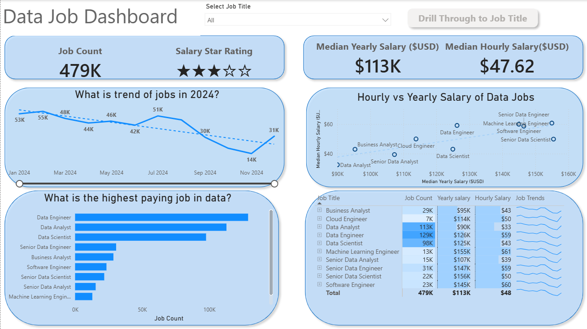

# 📊 Data Jobs DashBoard With Power BI

## Introduction
#### This dashboard is designed for  job seekers, professionals planning a career transition, and those considering a job switch. It addresses a key challenge in the data job market—relevant insights are often fragmented and difficult to interpret. By leveraging a real-world dataset of 2024 data science job postings, including roles, salary details, and locations, the dashboard brings everything together in one intuitive platform to help users understand market trends and pay patterns more clearly. 

### Dashboard File

#### You can find the file for the dashboard here: [Data_Jobs_dasboard.pbix](Datajob_Dashboard_project.pbix)

## Skills Showcased

#### This project was a journey through key Power BI features. Here's a look at what we mastered:

#### 1.⚙️ Data Transformation (ETL) with Power Query: Cleaned, shaped, and prepared the raw data for analysis by handling blanks, changing data types, and creating new columns.
#### 2.🧮 Implicit Measures: Formulated measures to derive key insights and KPIs like Median Yearly Salary and Job Count.
#### 3.📊 Core Charts: Utilized Column, Bar, Line, and Area Charts to compare job counts and track trends over time.
#### 4.🗺️ Geospatial Analysis: Leveraged Map Charts to visualize the global distribution of jobs.
#### 5.🔢 KPI Indicators & Tables: Used Cards to display key metrics and Tables to provide granular, sortable data.
#### 6.🎨 Dashboard Design: Designed an intuitive and visually appealing layout, exploring both common and uncommon chart types to best tell the data story.
#### 7.🖱️ Interactive Reporting:
#### - Slicers: To dynamically filter the report by Job Title.
#### - Buttons & Bookmarks: To create a seamless navigation experience.
#### - Drill-Through: To navigate from a high-level summary to a contextual, detailed view.

# DashBoard Overview

## Page 1:High-Level Market View

#### This is the main page of the dashboard.It gives clear insights on each job.

#### This is contains more info of the selected job using drill through method.

# Conclusion

#### This dashboard demonstrates how Power BI can turn raw job posting data into meaningful insights for career analysis. Users can interact with the data by slicing, filtering, and drilling down to support informed career decisions. Working on this project also significantly enhanced my understanding of data modeling, visualization, and analytical thinking.

# Credits 
### Luke Barousse
*Note:Some of the data has been taken from Luke Barousse*

